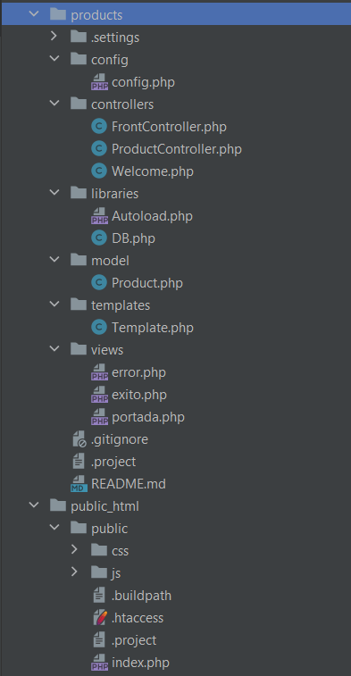
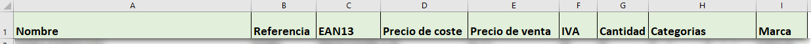

<h1>Aplicación para subir un fichero .CSV a nuestra base de datos</h1>

	Esta aplicación se realizó con la arquitectura de <b>Modelo Vista Controlador (MVC)</b> con 	<b>Controlador frontal</b>, que consiste en separar los datos de una aplicación, la interfaz de 	usuario, y la lógica de control en tres componentes distintos.  
	Se trata de un modelo muy maduro y que ha demostrado su validez a lo largo de los años en todo 	tipo de aplicaciones, y sobre multitud de lenguajes y plataformas de desarrollo.

	

	El fichero .CSV deberá tener una estructura en concreto para poderse subir. En el caso que el fichero no corresponda, no 
	permitirá subirlo.

    Para conectar con tu base de datos, debes configuarar el fichero config.php con los permisos necesarios
    <b>/products/config/config.php</b>

